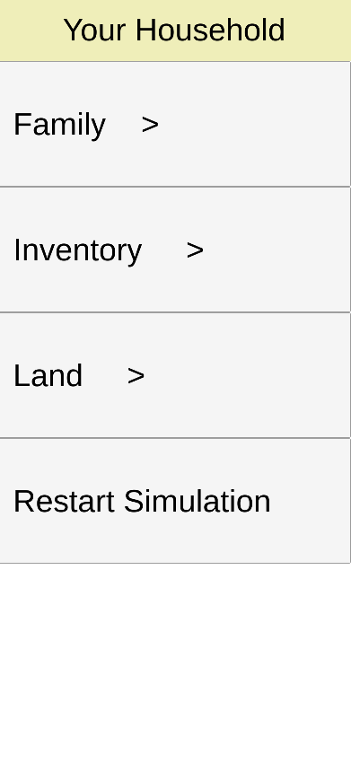

## Simulation Guide

When you open the app, you'll be greeted with the home screen. You'll have the option to skip to the simulation, or continue on with the educational stuff.

The educational stuff is the just information about the Green Revolution and its pros and cons. Simply click the next/back buttons to proceed.

Eventually you will reach the simulation. There will be a screen where you can select which household you want to play as, each with a different number of adults, children, and plots of land. 

When you select a household, you will be brought to the farm management screen - in the upper left corner you can see the current weather index (1 best, 5 worst), year, and phase. In the lower left corner there is a button that will display information about your household. In the lower middle there is a button to progress to the next phase. In the lower right corner there is a button to take you to the market, which should only be visible during phase 3. In the upper right corner of phases 1 and 2, you can see your total "labour value." Every adult by default contributes two labour points, but contributes four if they are assigned an ox. Near the top right is an information button which you can press to read about how to play the current phase.

### Household Screen
When you click the lower left button you will be taken to a screen where you can view your adults, children, inventory, and land (which takes you back to the farm management screen). 
By clicking on the Family button, you will have the option to view the adults and children in your household. In the adults section it lists all your adults (and hired labour, which last for one year), and there are buttons for you to assign oxen to them (if you have any). In the children section it lists all your children, as well as how many years until they become adults. In this screen there is also the option to rechoose your starting household, restarting the simulation.

In the inventory you can see how many of every item you own (except land and labour, which can be seen in farm management and the adult list respectively).

### Phase 1
In year 1, there is nothing for you to do in this phase, so it automatically skips to phase 2.

At the start of years 2+, there may be random events - if there is one, a popup will be shown. Events include making certain market items unavailable or changing their price, or adding a child to your family.

In phase 1 you irrigate your crops. You can irrigate up to 8 plots of land per tubewell owned. Of course, this means you can't irrigate any land if you don't have tubewells - you will receive a popup to prompt to skip to phase 2 if this is the case. Irrigating one plot of land costs two labour points.

### Phase 2
In this phase you select which plots of land you want to harvest. Every plot costs one labour point. 

The yield amount of each plot of land depends on what type of seed and fertilizer it has, as well as the weather and whether it's irrigated or not. The entire table of values can be found in `Assets/Backend/YieldPerformanceTable.cs` but the gist of it is:
- Low/high fertilizer increases yield by a low/high amount respectively
- Lower weather index = better yield, higher weather index = worse yield
- HYC seeds perform better than regular seeds in good weather, but worse in worse weather
- If a plot of land is irrigated, it uses the best weather index (1) to calculate its yield

### Phase 3
In this phase you start in the market. Here you can buy items and sell wheat (by the tens or by the hundreds. Wheat sell price is the same as the buy price). Their descriptions as shown in the market should be explanatory enough. In the top right corner you should see your money and wheat.

Some items have purchase limits:
- You can only buy as many oxen as adults in your family
- You can only own a maximum of 16 plots of land
- You can only own a maximum of two tubewells

At the bottom of the market screen is a button that takes you back to the farm management screen. 

This time there are three extra toggles at the bottom for planting. Yes, phase 3 is the planting phase. If you toggle the HYC Seed option, you can select plots of land to plant HYC seeds on them. It's a similar deal for the low/high fertilizer options. By default, plots have regular seed and no fertilizer.

To remove HYC seed or fertilizer from a plot of land, simply select it with the proper toggle enabled.

After the simulation (normally after the harvest on the 7th year unless when all your family starve to death), there will be a results screen to show your final score. This is followed by some self reflection questions to see how much you've learned.

