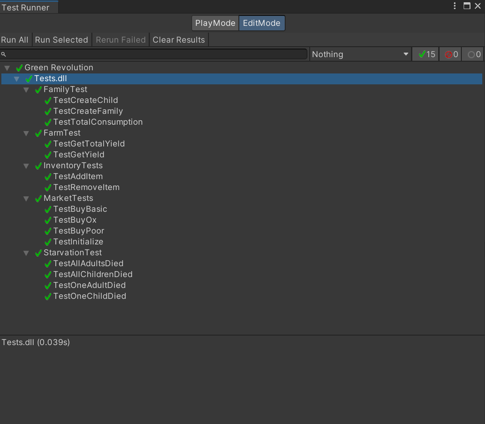
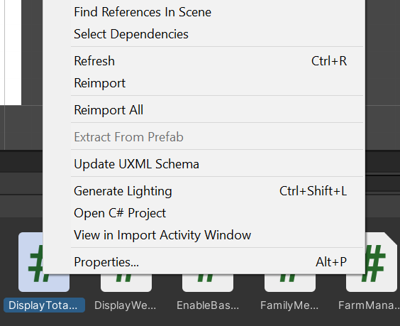
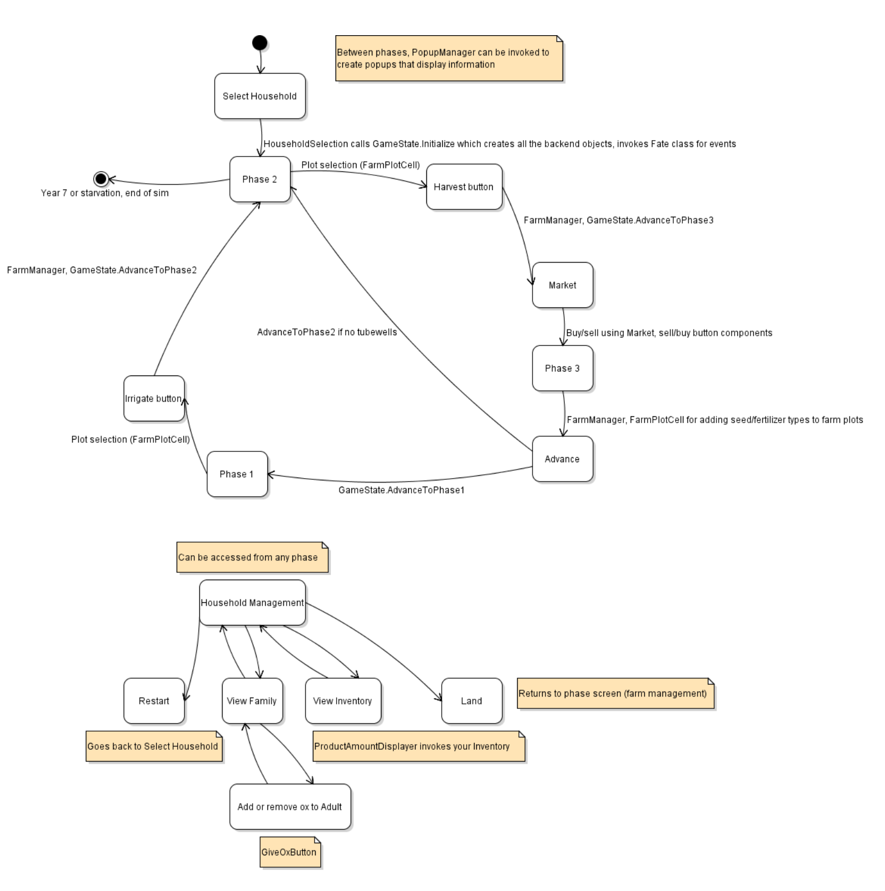

# GREEN REVOLUTION TECHNICAL DOCUMENT

Here you will find some clarifications about code and project structure. This assumes you have working knowledge of Unity and (possible) Unity's UI Builder.

## Project Structure
It's mostly a standard Unity project. There's standard stuff like an Assets folder containing Prefabs, Scenes, and Scripts.

There are two types of scenes: non-simulation and simulation. It's rather self-explanatory what these mean. Note that these scenes are all lumped together in the Scenes folder, because it would be complicated in terms of scene loading if we separated them into different folders.

The simulation scenes are:
- HouseholdSelection
- ManageFarm
- ManageHousehold
- ManageFamily
- ViewInventory
- Market

And the non-simulation screens are the rest of them (surprise!). If you want to start testing the simulation, you can play starting with the HouseholdSelection scene. If you want to playtest the entire app, you should start with the Welcome scene.

## Non-simulation Scenes
These are not built with Unity UI but rather UI Documents. These work similarly to HTML/CSS, but catered for Unity projects. In these scenes you'll find a UIDocument game object which contains the UI. The UI source assets are in `Assets/Screen UI` (note that there are some scripts here. We put those there because they are used exclusively to program this UI).

You'll notice that some scenes have a PopupOnDefault game object, these make it so a popup appears as soon as you enter the scene. In all non-simulation scenes the UIDocument has a "UI Document Load Scene Button" component which makes it so buttons (of class ".load-scene-button") load another scene on click, the name of which is their Tooltip.

The Results scene DOES, however, contain some Unity UI. This is because this scene uses the same popup system as the simulation screens (which is different from the system used by the non-simulation screens).

## Scripts
Within the Scripts folder there's a Backend folder and a Components folder, as long with an assembly definition. The assembly definition is so that we could use Unity's testing framework, the unit tests of which can be found in `Assets/Tests`.

The term "Backend" is used loosely here, it's more or less all the classes that don't inherit from MonoBehaviour, and "Components" are all the classes that do.

## Testing
As mentioned previously we do have unit tests. In the Unity editor, go to Window > General > Test Runner and you should be able to run our tests there. Double click on a test suite's name to run it, or double click on "Tests.dll" to run multiple test suites at once.

## Components
We tried our best to adhere to the "scripts are custom components" philosophy that Unity appears to have, meaning scripts that we write should be easily reusable on different GameObjects. Take `ProductPriceDisplayer.cs`, for example. It uses serialized fields for easy customizability, so in theory it's easy to create multiple text labels and have them display the price of any product in the market.

If you have any doubts about where a component is used you can right click them and click "Find References In Scene."

## GameState
This class contains a lot of the simulation logic, including initialization and advancing between phases. We won't give an in-depth explanation here because you should be able to read the code yourself, but in summary:
- Initialize: Initializes the simulation as well as the market (populates the market with products).
- AdvanceToPhaseOne: Advances the simulation state to phase 1, the growing season. The losing condition (starvation) is handled here, which is when all your adults die. In years 2+ it chooses a random event to happen. This phase is skipped in year 1/if you don't have a tubewell.
- AdvanceToPhaseTwo: Advances the simulation state to phase 2, the harvest season. Admittedly there isn't much logic here, the majority of the gameplay logic is done in `Components/FarmManager.cs`
- AdvanceToPhaseThree: Advances the simulation state to phase 3, the planting season. Clears your farm plot and removes any hired labour you may have purchased the previous year (they only last for a year). Much of the actual purchasing is done in the Market scene and the components it uses.

## Simulation Flowchart
Here is a flowchart that, at a high level, shows how everything works together.

This can also be found in `deliverables/D5/sim-flowchart.state.violet.html`